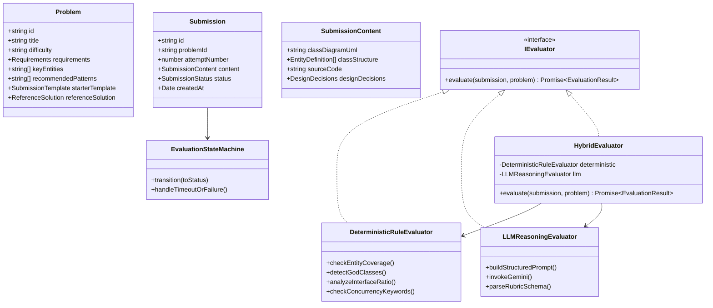

# Design Note: Low-Level Design (LLD) Practice Platform

## 1. System Overview & Core Philosophy
The LLD Practice Platform is a lightweight, domain-driven web application designed to guide software engineers through an iterative object-oriented design loop.

### Core Domain Model & Interfaces
The architecture follows clean object-oriented principles:

---

## 2. Answers to The Main Design Questions

### Q1: What does a learner actually need to provide for an LLD attempt to be meaningful?
A code dump alone is too unstructured; a simple diagram alone lacks method semantics. To be meaningful, an LLD attempt must provide:
1. **Domain Model & Entities**: Names, responsibilities, and structural relationships (inheritance, composition, aggregation).
2. **Key Interfaces & Public Contracts**: Method signatures, return types, and parameter abstractions.
3. **Explicit Design Decisions & Trade-offs**:
   - Why a specific pattern was chosen (e.g., *Strategy Pattern for dynamic pricing*).
   - Concurrency & Thread-Safety Strategy (e.g., *Synchronized methods vs ReentrantLock vs optimistic locking*).
   - Extensibility considerations (e.g., *How will the system support a new vehicle type without modifying existing spot allocation?*).

### Q2: What makes feedback useful when there can be more than one valid LLD solution?
1. **Rubric-Based Evaluation rather than Exact-Match Matching**:
   We evaluate against fundamental design heuristics (SOLID, Separation of Concerns, Loose Coupling, High Cohesion) rather than comparing against a fixed "canonical" class tree.
2. **Pros & Cons Analysis**:
   Explaining *why* a decision has trade-offs (e.g., "Using Enum for spot types is simple, but limits runtime creation of custom spot dimensions. A class hierarchy or type object pattern would be more extensible.").
3. **Concrete Refactoring Steps**:
   Actionable pointers showing exactly which class violates SRP and how to extract an abstraction.
4. **Alternative Design Exploration**:
   Presenting alternate valid architectural patterns for learner contemplation.

### Q3: Which parts of evaluation should be deterministic, and which benefit from an LLM?
| Component | Evaluator Type | Rationale |
| :--- | :--- | :--- |
| **Entity Coverage Check** | **Deterministic** | Verifies presence of core entities (e.g., `ParkingSpot`, `Ticket`, `Payment`) with 100% precision without LLM hallucination. |
| **God Class Heuristic** | **Deterministic** | Method count > 8 or field count > 10 in a single class flags high probability of SRP violation. |
| **Interface / Abstraction Ratio** | **Deterministic** | Ratio of interfaces to concrete classes measures dependency inversion adherence. |
| **Concurrency Primitives** | **Deterministic** | Detection of synchronization, locks, or thread-safety primitives. |
| **Domain Responsibility Boundaries** | **LLM Reasoning** | Semantic understanding of whether `ParkingLot` is orchestrating vs doing too much. |
| **Design Pattern Appropriateness** | **LLM Reasoning** | Distinguishing genuine pattern utility from over-engineering. |
| **Trade-Off Quality & Coherence** | **LLM Reasoning** | Evaluating if the candidate's stated trade-offs match their actual code. |

### Q4: How would the design accommodate another evaluation approach or submission format later?
By adhering strictly to the **Strategy Pattern** and **Adapter Pattern**:
- `IEvaluator`: Standard interface implemented by `DeterministicRuleEvaluator`, `LLMReasoningEvaluator`, `HybridEvaluator`, and easily extensible to `CompilerBasedEvaluator` (e.g. running `javac` or `tsc`), or `PeerReviewEvaluator`.
- `ISubmissionParser`: Standard parser interface allowing inputs via PlantUML, Mermaid markdown, TypeScript AST, Java AST, or a drag-and-drop node canvas.

### Q5: What should happen if evaluation takes time or fails?
1. **Async Lifecycle State Machine**:
   States: `DRAFT` $\rightarrow$ `QUEUED` $\rightarrow$ `EVALUATING` $\rightarrow$ `COMPLETED` or `FAILED`.
2. **Resilient Fallback**:
   If the LLM endpoint times out (e.g., > 12s) or returns an error, the system automatically falls back to the deterministic evaluation engine, rendering full static analysis findings with a warning indicator.
3. **No Distributed Over-engineering**:
   In this prototype, evaluation runs in-process or via an Express asynchronous handler with polite UI polling / optimistic state, ensuring instant user feedback without requiring Kafka, Celery, or Redis.

---

## 3. Key Trade-offs Made in MVP
- **Visual UML Generator vs Canvas Drag-and-Drop**:
  *Decision*: We provide an automatic interactive UML renderer from the user's class definitions and code, combined with structured editors.
  *Rationale*: Senior engineers think in terms of contracts and relationships; canvas drag-and-drop is slow and fiddly for rapid practice.
- **In-Memory / LocalStorage Persistence vs External DB**:
  *Decision*: Client-side state persisted in `localStorage` alongside server-side processing.
  *Rationale*: Keeps the prototype zero-friction, instant-start, and totally resilient without requiring external DB setup.
